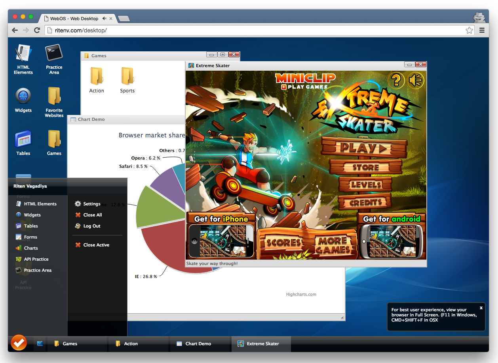

# Retro Desktop UI

A retro-looking desktop UI with icons, folders, windows, taskbar and keyboard shortcuts!

Built **back in 2012**, this retro desktop UI is still something I cherish in terms of how it functions. It is built using vanilla JS (no modern JS frameworks), while utilizing the jQuery library. All components: `UXWindow`, `UXIcon`, etc. are written in vanilla JS.

## The Premise

The Retro Desktop UI mimics a typical desktop interface. The idea is to have mini applications served from within the desktop UI, run via native web views (iframe) or dynamically loaded templates.

## The Architecture

Built back in 2012, the architecture is quite simple and basic. However, the API is extensive and extendable to create powerful applications on top of the UI as base.

Each mini application starts with an icon placed on the desktop. The icon, upon clicking, spawns a new window process that loads within it, the target URL / iframe.

## The API

The UI comes with a very handy and complete API, that allows tinkering with almost every component of the UI.

1. #### Creating new Icons

	To create a new icon / mini-app on the desktop, include the below snippet upon initializing:

		UXIcon({
			id: 'terminal-app',
	        iconClass: 'icon-terminal',
	        iconClassSmall: 'icon-terminal-16', 
	        title: 'Practice Area', 
	        autoLoad: 'ajax-samples/practice.html', 
	        mode: 'ajax',
	        width: 480,
	        height: 480,
	        left: 150
	    });

	_Hint: run the above code in the web console, when you open the desktop UI watch the icon appear smoothly, and then click on it_

2. #### Creating new Windows

	Using the same configuration and syntax as that of `UXIcon`, you can spawn up a new mini-window within the UI by using the `UXWindow` component:

		UXWindow({
			id: 'terminal-app',
	        iconClass: 'icon-terminal',
	        iconClassSmall: 'icon-terminal-16', 
	        title: 'Practice Area', 
	        autoLoad: 'ajax-samples/practice.html', 
	        mode: 'ajax',
	        width: 480,
	        height: 480,
	        left: 150
	    });

3. #### Opening Existing Icons

	Existing mini-apps / icons can be easily opened using the global `Desktop` object:
	
		Desktop.open('terminal-app'); //pass the id of the icon you previously used to create it

4. #### Playing with Existing Windows

	Existing open windows can be easily played-around with, using the global Desktop's `get` method:

		Desktop.getWindow('terminal-app').trigger('minimize'); //will minimize the terminal app window
		Desktop.getWindow('terminal-app').trigger('close'); //will close the terminal app window

5. #### Adding Folders

	A folder is typically just an icon, with an array of `items` passed to it. Below is an example folder:

		UXIcon({
		    id: "other-websites-folder",
		    iconClass: "folder", 
		    iconClassSmall: "folder16", 
		    title: "Favorite Websites", 
		    width: 400,
		    status: "List of favorite Websites",
		    hideFromTaskMenu: true, //will not show up in the START menu
		    items: [
		        {
		            iconClass: "icon-website", 
		            iconClassSmall: "icon-website-16", 
		            title: "Riten\'s Blog", 
		            status: "Read on!",
		            autoLoad: "http://www.riten.io/",
		            mode: "iframe", 
		            width: 608,
		            height: 520
		        }, {
		            iconClass: "icon-website", 
		            iconClassSmall: "icon-website-16", 
		            title: "Riten\'s Projects", 
		            status: "Read on!",
		            autoLoad: "http://www.riten.io/projects",
		            mode: "iframe", 
		            width: 608,
		            height: 520
		        }
	        ]
	    });

6. #### Event Listeners

	A powerful feature is to listen to events when a window opens, closes, maximizes, minimizes, drags, completes loading etc. and perform certain tasks upon those events. Dig through the existing code in `js/App.js` to see what events are supported and how to use them - **full documentation will be listed soon.**

## Conclusion

**Retro Desktop UI** is developed by [@ritenv](http://twitter.com/@ritenv) out of his spare time, back in the days when he was just beginning to learn JavaScript. If you have any ideas, suggestions or things you'd like to see in this app, feel free to fork out and explore!